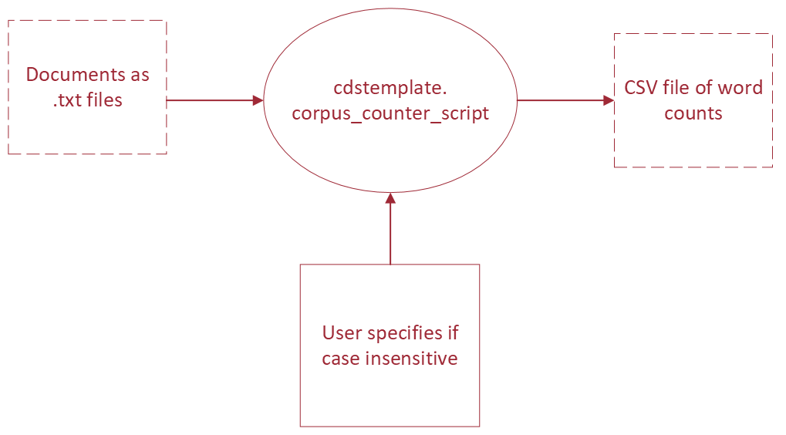

# PythonProjectTemplate

This repository presents some opinionated guidelines for creating a data science and machine learning project in Python, using the simple example of scripts for counting words in text documents. By following these guidelines you can make it easy for your code to be tested and understood by others (or yourself months from now), so they can reproduce your experiments.

These are just guidelines, not strict rules, so feel free to alter them to meet your needs. Just keep in mind the goal is that others can understand and run your code, even if you aren't around to ask questions to!

This template draws a lot of inspiration from [Cookiecutter Data Science](https://drivendata.github.io/cookiecutter-data-science/). Please read their awesome explanations!

# Getting Started
## Installing Dependencies and Packages
Use these steps for setting up a development environment to install and work with code in this template:
1) Set up a Python 3 virtual environment using [Conda](https://docs.conda.io/projects/conda/en/latest/user-guide/install/index.html#) or [Virtualenv](https://virtualenv.pypa.io/en/latest/index.html). Read [Python Virtual Environments: A Primer](https://realpython.com/python-virtual-environments-a-primer/#the-virtualenv-project) for details on how to get started with virtual environments and why you need them.
2) Activate your virtual environment.

3) Install the package.
	- If you want to just use the scripts and package features, install the project by running `pip install .` from the root directory.
	- If you will be changing the code and running tests, you can install it by running `pip install -e .[test,dev]`. The `-e/--editable` flag means local changes to the project code will always be available with the package is imported. You wouldn't use this in production, but it's useful for development.


For example, if you use Conda, you would run the following to create an environment named `template` with python version 3.10, then activate it and install the package in developer mode:
```
$ conda create -n template python=3.10 -y
Collecting package metadata (current_repodata.json): done
Solving environment: done

## Package Plan ##

  environment location: /home/virginia/miniconda3/envs/template

  added / updated specs:
    - python=3.10


The following NEW packages will be INSTALLED:

    package                    |            build
    ---------------------------|-----------------
...

$ conda activate `template`
$ pip install -e .[test,dev]
Obtaining file:///home/virginia/workspace/PythonProjectTemplate
  Installing build dependencies ... done
  Getting requirements to build wheel ... done
  Installing backend dependencies ... done
    Preparing wheel metadata ... done
Collecting numpy
...
```


## Directory Structure

# Communication Tools and Code
When you work with others, it's not just about the code!

The README, CHANGELOG and docstrings are just as important.

- _README.md_ : Summarize the project's purpose and give installation instructions.
- _CHANGELOG.md_ : Tell the user what has changed between versions and why, see [Keep A CHANGELOG](https://keepachangelog.com/en/1.0.0/)
- docstrings: Appear directly in your code and give an overview of each function or object. They can be printed using `help(object)` from the python interpreter or used to automatically generate API documentation with a tool like [Sphinx](https://www.sphinx-doc.org/en/master/index.html). There are many different docstring formats. Your team can choose any they like, just be consistent. This template uses [reStructuredText style](https://peps.python.org/pep-0287/).

Read [Real Python's Documenting Python Code: A Complete Guide](https://realpython.com/documenting-python-code/) for more ideas about effectively documenting code. The `.md` files are written using [Markdown](https://www.markdownguide.org/), a handy formatting language that is automatically rendered in Github.

# Tests

Although it's [impossible to generally prove that your code is bug-free](https://en.wikipedia.org/wiki/Undecidable_problem), automated testing is a valuable tool. It provides:
- Proof that your code works as intended in most common examples and important edge cases
- Instant feedback on whether changes to the code broke its functionality
- Examples of how to use the code, a type of documentation

This repository has tests configured using [pytest](https://pytest.org/) and the Github action defined in `.github/workflows/python_package.yml` will run tests every time you make a pull request to the main branch of the repository. [Unittest](https://docs.python.org/3/library/unittest.html#module-unittest) and [nose2](https://docs.nose2.io/en/latest/) are other common test frameworks for python.

You can run tests locally using `pytest` or `python -m pytest` from the command line from the root of the repository or configure them to be [run with a debugger in your IDE](https://code.visualstudio.com/docs/python/testing). For example:
```
$ pytest
======================== test session starts ========================
platform linux -- Python 3.10.4, pytest-7.1.2, pluggy-1.0.0
rootdir: /home/virginia/workspace/PythonProjectTemplate
collected 2 items

tests/test_sample_module.py .
```

Read the following articles for tips on writing your own tests:
- [Getting Started With Testing in Python](https://realpython.com/python-testing/)
- [13 Tips for Writing Useful Unit Tests](https://betterprogramming.pub/13-tips-for-writing-useful-unit-tests-ca20706b5368)
- [Why Good Developers Write Bad Unit Tests](https://mtlynch.io/good-developers-bad-tests)

# Reproducible Experiments
In practice, data science often relies on pipelining many operations together to prepare data, extract features, then train and evaluate models or produce analysis. Whether someone can reproduce your experiments depends on how clearly you lay out the pipeline and parameters that you use for each 'node' in the pipeline, including stating where to find the input data and how it should be formatted.

In practice, you should write scripts that are flexible enough to change the parameters you'd like to experiment with and define the pipeline using a directed acyclic graph (DAG), where the outputs from earlier steps become the dependencies for later ones. It's good practice to draw out the DAG for your experiment first, noting inputs, outputs and parameters, before you code scripts for the pipeline, like this:



## Reusable Scripts
Our 'experiment' here is simply counting the occurrence of words from a set of documents, in the form of text files, then writing the counts of each word to a CSV file. This operation is made available to users via the `cdstemplate.corpus_counter_script` and by using the [`argparse` command-line parsing library](https://docs.python.org/3/library/argparse.html#module-argparse), we clearly describe the expected input parameters and options, which can be displayed using the `--help` flag. There are [other command-line parsers](https://realpython.com/comparing-python-command-line-parsing-libraries-argparse-docopt-click/) you can use, but `argparse` comes with python, so you don't need to add an extra requirement.


Since we have made the package installable, users can run it using `python -m cdstemplate.corpus_counter_script` or `python cdstemplate/corpus_counter_script.py`, but both work the same way:
```
$ python cdstemplate/corpus_counter_script.py --help
usage: corpus_counter_script.py [-h] [--case-insensitive]
                                csv documents [documents ...]

A script to generate counts of tokens in a corpus

positional arguments:
  csv                   Path to the output CSV storing token counts. Required.
  documents             Paths to at least one raw text document that make up
                        the corpus. Required.

options:
  -h, --help            show this help message and exit
  --case-insensitive, -c
                        Default is to have case sensitive tokenization. Use
                        this flag to make the token counting case insensitive.
                        Optional.

$ python -m cdstemplate.corpus_counter_script --help
usage: corpus_counter_script.py [-h] [--case-insensitive]
                                csv documents [documents ...]

A script to generate counts of tokens in a corpus
...
```

Using the help message, we can understand how to run the script to count all the tokens in the text files in `data/gutenberg` in a case-insensitive way, saving token counts to a new csv file, `data/gutenberg_counts.csv`:
```
$ python cdstemplate/corpus_counter_script.py data/gutenberg_counts.csv data/gutenberg/*.txt --case-insensitive
INFO : 2022-05-20 17:45:30,540 : __main__ : Command line arguments: Namespace(csv='data/gutenberg_counts.csv', documents=['data/gutenberg/austen-emma.txt', 'data/gutenberg/austen-persuasion.txt', 'data/gutenberg/austen-sense.txt', 'data/gutenberg/bible-kjv.txt', 'data/gutenberg/blake-poems.txt', 'data/gutenberg/bryant-stories.txt', 'data/gutenberg/burgess-busterbrown.txt', 'data/gutenberg/carroll-alice.txt', 'data/gutenberg/chesterton-ball.txt', 'data/gutenberg/chesterton-brown.txt', 'data/gutenberg/chesterton-thursday.txt'], case_insensitive=True)
INFO : 2022-05-20 17:45:30,540 : __main__ : Tokenizing document number 0: data/gutenberg/austen-emma.txt
DEBUG : 2022-05-20 17:45:30,540 : cdstemplate.sample_module : Tokenizing '[Emma by Jane Austen 1816]
...
```

## Data Dependencies Tools
[Build automation tools](https://en.wikipedia.org/wiki/Build_automation) like [Make](https://en.wikipedia.org/wiki/Make_(software)) have been used to resolve dependencies and compile software since the 1970s. Build automation can also be used in data science and machine learning workflows for [many of the same reasons](https://en.wikipedia.org/wiki/Build_automation#Advantages), like eliminating redundant tasks, maintaining history and improved quality and consistency through automating processes. Using a build tool can also be a documentation and communication tool, since it declares the most common ways to run code and reproduce experiments.

In the Machine Learning Operations (MLOps) community these automation tools are often called [task or workflow orchestration](https://www.datarevenue.com/en-blog/airflow-vs-luigi-vs-argo-vs-mlflow-vs-kubeflow). There are many options, such as [Airflow](https://airflow.apache.org/), [Luigi](https://github.com/spotify/luigi), [MLflow](https://mlflow.org/), [Kubeflow](https://www.kubeflow.org/) and [iterative.ai's DVC and CML](https://iterative.ai/), all with various additional features for versioning experiments, scheduling and visualizations, but at the core they are all built on the same dependency graph principle as the OG [Make](https://opensource.com/article/18/8/what-how-makefile).

In this repository, we have set up a


## A Note on Notebooks
Jupyter notebooks are useful tools for exploratory data analysis, prototyping baseline models and creating visualizations. However, they are _not_ an acceptable way to hand-off code for others to reproduce. Have you ever tried to run someone else's notebook, only to find out a cell was deleted, and you have no idea what it was supposed to do?

[Don't put data science notebooks into production](https://martinfowler.com/articles/productize-data-sci-notebooks.html), they are [hard to test, version, parametrize and keep track of state](https://www.reddit.com/r/datascience/comments/ezh50g/jupyter_notebooks_in_productionno_just_no/).

There _are_ [companies that use notebooks in production architecture](https://blog.goodaudience.com/inside-netflixs-notebook-driven-architecture-aedded32145e), but they have entire Devops organizations to help configure deployment and _still_ use workflow tools like [papermill](https://papermill.readthedocs.io/en/latest/) and Airflow to parametrize notebook dependencies. Unless you are willing to put in the effort to parametrize your notebooks in pipeline workflows, don't use them when stability and reproducibility matter.

Best practices for working with notebooks are changing as they become more popular. However, for now most of these services are too expensive for our partners or difficult to configure. You can use a notebook for prototyping and exploratory analysis, but once the project moves forward, use [`nbconvert`](https://linuxhint.com/convert-jupyter-notebook-python/) to convert the notebook to python code, then add some tests!